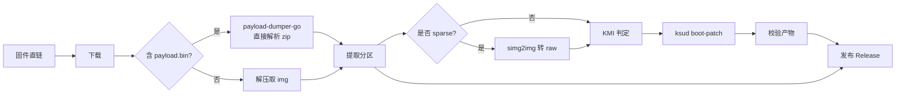

# KernelSU Patcher · GitHub Actions

在云端自动完成：**下载固件 → 解包提取分区 → KernelSU 修补 → 发布 Release**。

全程由 GitHub Actions 运行，无需本地环境，也不必把 ROM 拉到自己机器上。

## ✨ 功能

- 🔗 **直链下载固件** — 支持多个链接、断点续传、aria2c 多线程加速
- 📦 **自动解包** — 自动识别 OTA 包（`payload.bin`）、fastboot 包、`super.img` 动态分区
- 🎯 **自定义提取分区** — 想提哪个提哪个（`boot` / `init_boot` / `vendor_boot` / …）
- 🧩 **KernelSU 自动跟进最新版** — 默认取 `latest` release，也可锁定指定版本
- 🔍 **KMI 三级自动判定** — 内核探测 → 内核版本识别 → ramdisk `build.prop` 反推
- 🧠 **非 GKI 设备智能诊断** — 自动识别内核 < 5.10 的设备并说明原因
- ✅ **产物校验** — 检查 magic、页对齐、ramdisk 内是否含 `kernelsu.ko`
- 🚀 **自动发布 Release** — 修补后的镜像与原始分区一并上传，附 `SHA256SUMS.txt`

## 🚀 使用方法

### 1. Fork 本仓库

### 2. 触发构建

进入 **Actions** → **Build KernelSU Patched Images** → **Run workflow**，填写参数：

| 参数 | 说明 | 示例 |
|---|---|---|
| `firmware_url` | **（必填）** 固件直链 | `https://example.com/ota.zip` |
| `partitions` | 要提取并发布的原始分区 | `boot,init_boot,vendor_boot` |
| `patch_partitions` | 要修补的分区（留空=同上） | `init_boot` |
| `kernelsu_version` | KernelSU 版本 | `latest` / `v3.3.0` |
| `kmi` | 强制指定 KMI（留空自动判定） | `android15-6.6` |
| `arch` | 目标架构 | `aarch64` / `x86_64` |
| `release_tag` | 自定义 Release tag | `my-pixel8-ksu` |
| `allow_shell` | 允许 shell 获取 root | `false` |
| `enable_adbd` | 强制开启 adbd 并关闭鉴权 | `false` |
| `cmdline` | 追加到 boot 头的 cmdline | 留空 |
| `extract_all` | 提取 payload 内全部分区 | `false` |
| `create_release` | 是否创建 Release | `true` |

### 3. 取回产物

构建完成后，产物在两个地方：

- **Releases** — `patched/`（已 Root 镜像）、`partitions/`（原始分区）、`SHA256SUMS.txt`
- **Artifacts** — 同一份内容，保留 14 天

## ⏰ 定时自动构建

仓库内已配置每周一 03:00 UTC 自动跑一次，以便跟随 KernelSU 更新。

定时任务需要配置默认固件地址（**Settings → Secrets and variables → Actions → Variables**）：

| 变量名 | 说明 |
|---|---|
| `DEFAULT_FIRMWARE_URL` | 定时任务使用的固件直链 |

## 📥 刷入

```bash
# 校验完整性
sha256sum -c SHA256SUMS.txt

# 刷入（注意区分 boot / init_boot，以及 A/B 槽位）
adb reboot bootloader
fastboot flash init_boot init_boot-v3.3.0-patched.img
fastboot reboot
```

> ⚠️ **务必确认固件版本与设备完全匹配**。刷错分区的 boot 镜像可能导致无法开机。
> 刷入前请先备份原分区：
> ```bash
> adb shell su -c "dd if=/dev/block/by-name/init_boot of=/sdcard/stock_init_boot.img"
> ```

## 🧠 关于 KMI 与 boot / init_boot

KernelSU 通过 **LKM（可加载内核模块）** 方式工作，必须匹配设备的 **KMI**
（Kernel Module Interface，如 `android15-6.6`）。

脚本会按以下顺序自动判定 KMI：

1. **内核探测** — 直接在镜像中搜索 `android15-6.6` 这类字符串
2. **内核版本识别** — 解析 `Linux version 6.6.66-android15-...` 横幅
3. **ramdisk 反推** — `init_boot` 不含内核时，读取其 `build.prop` 里的
   Android 版本（如 `15`），匹配唯一的候选 KMI

若都无法确定（例如 `init_boot` 里没有 `build.prop`），请手动指定 `kmi` 参数。

查看自己设备的 KMI：

```bash
adb shell uname -r
# 例如输出 6.6.66-android15-8-gxxx  →  KMI 为 android15-6.6
```

若不确定该修补 `boot` 还是 `init_boot`：

| Android 版本 | 通常修补 |
|---|---|
| Android 12 及以下 | `boot` |
| Android 13 及以上 | `init_boot` |

## ⚠️ 重要限制：仅支持 GKI 内核

KernelSU 的 LKM 模式要求内核为 **GKI（通用内核镜像，≥ 5.10）**。当前版本
（v3.3.0）支持的 KMI 如下：

```
aarch64/android12-5.10    aarch64/android14-5.15    aarch64/android16-6.12
aarch64/android13-5.10    aarch64/android14-6.1     aarch64/android17-6.18
aarch64/android13-5.15    aarch64/android15-6.6
```

因此以下设备**无法**通过本工具获得 root：

- 内核版本低于 5.10 的老设备（如内核 `5.4.302-qgki` 的机型）
- 使用厂商定制内核、未遵循 GKI 规范的设备

**实测案例**：LineageOS 的 `lemonadep`（一加 9 Pro）构建使用
`5.4.302-qgki` 内核 —— 这属于 **QKGI**（Qualcomm GKI 变体），
不带 `androidNN` 版本标记，不在 KernelSU LKM 支持范围内。
此类设备需改用 KernelSU 的**内核内置方案**（自行编译内核）。

脚本遇到这类情况会主动诊断并给出明确提示，而不是抛出含糊的错误。

## 📁 项目结构

```
.
├── .github/workflows/
│   ├── build.yml                  # 主流程
│   └── smoke.yml                  # 冒烟测试
├── scripts/
│   ├── utils.py                   # 公共工具（日志/命令/工具定位/KMI 推断）
│   ├── setup_tools.py             # 安装 payload-dumper-go、lpunpack、magiskboot
│   ├── fetch_kernelsu.py          # 获取最新 KernelSU 与 ksud
│   ├── download.py                # 固件下载（断点续传/aria2c）
│   ├── unpack.py                  # 解包并提取分区
│   ├── patch.py                   # KernelSU 修补
│   ├── verify.py                  # 产物校验
│   ├── release.py                 # 整理发布产物
│   └── gen_notes.py               # 生成 Release 说明
├── tests/smoke_test.py            # 端到端冒烟测试
└── tools/                         # 运行时自动下载的工具（不入库）
```

## 🔧 工作流程



## 🧪 本地测试

```bash
# 1. 准备工具
python3 scripts/setup_tools.py
python3 scripts/fetch_kernelsu.py

# 2. 运行冒烟测试
python3 tests/smoke_test.py

# 3. 单步调试
python3 scripts/download.py --urls "https://example.com/ota.zip" --out-dir downloads
python3 scripts/unpack.py   --input downloads --partitions boot,init_boot
python3 scripts/patch.py    --images work/unpacked/partitions/boot.img
python3 scripts/verify.py   --patched work/patched/boot-*.img
```

## ❓ 常见问题

**Q: 提示 `Unable to auto detect KMI version`**
镜像探测不到 KMI。若是 `init_boot`，可用 `kmi` 参数手动指定；
若提示"非 GKI 内核"，说明该设备不支持 LKM 模式。

**Q: 请求的分区不存在（如设备没有 `init_boot`）**
脚本会自动跳过并继续处理其余分区，不会整体失败。

**Q: 我能修补已经打过 Magisk 的镜像吗？**
不行。KernelSU 会拒绝修补已被 Magisk 处理的镜像。请使用**原厂固件**。

**Q: 修改脚本后如何避免破坏流程？**
`.github/workflows/smoke.yml` 会在 push/PR 时自动跑冒烟测试。

## 📜 致谢

- [tiann/KernelSU](https://github.com/tiann/KernelSU) — 提供 ksud 与 LKM
- [topjohnwu/Magisk](https://github.com/topjohnwu/Magisk) — 提供 magiskboot
- [ssut/payload-dumper-go](https://github.com/ssut/payload-dumper-go) — 解析 payload.bin

## ⚖️ 免责声明

本项目仅供学习与个人设备维护使用。刷机有风险，请自行承担后果。
